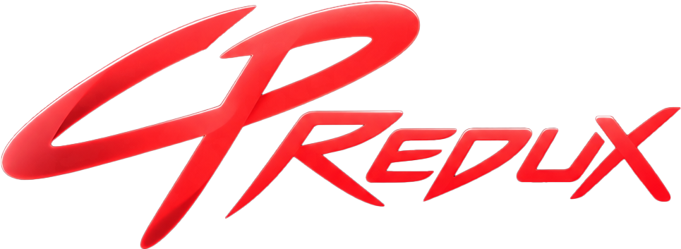
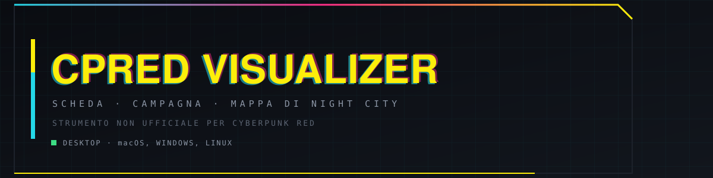

<p align="center">
  
</p>

<p align="center">
  
</p>

<p align="center">
  <b>Suite Gestionale, Scheda Personaggio, Tavolo Dadi 3D e Mappa Interattiva di Night City.</b><br>
  Applicazione desktop nativa per <b>macOS</b>, <b>Windows</b> e <b>Linux</b>.<br>
  <i>(Software esclusivamente Desktop: nessun supporto né vincolo mobile per Android / iOS)</i><br>
  <sub>Progetto non ufficiale per Cyberpunk RED, sviluppato in conformità con la 
  <a href="https://rtalsoriangames.com/homebrew-content-policy/">Homebrew Content Policy</a> di R. Talsorian Games.</sub>
</p>

<p align="center">
  
  
  
  
</p>

<p align="center">
  
</p>

## Ultima Release & Download Automatici

I link di download sottostanti puntano **sempre all'ultima versione stabile disponibile** (`/releases/latest`), aggiornandosi in automatico ad ogni nuova pubblicazione sia su GitHub che su GitLab.

### Download Ufficiali

| Piattaforma | Architettura | Formato & Descrizione | Download Diretto Ultima Versione |
| :--- | :--- | :--- | :--- |
| Windows | x64 (Windows 10 / 11) | Installer Setup Diretto (.exe) | [Scarica Installer Windows (.exe)](https://github.com/Tia004/cpredux/releases/latest/download/cpredux-windows-setup.exe) |
| Windows | x64 (Windows 10 / 11) | Pacchetto Portatile (.zip) | [Scarica Windows Portable (.zip)](https://github.com/Tia004/cpredux/releases/latest/download/cpredux-windows.zip) |
| macOS | Universal (Apple Silicon & Intel) | Applicazione Standalone .app (ZIP) | [Scarica macOS Universal (.zip)](https://github.com/Tia004/cpredux/releases/latest/download/cpredux-macos.zip) |
| Linux | x86_64 / Desktop | Pacchetto Standalone AppImage | [Scarica Linux AppImage (.AppImage)](https://github.com/Tia004/cpredux/releases/latest/download/cpredux-linux.AppImage) |
| Scheda Release GitHub | Multi-Platform | Hub release, log e file compilati | [GitHub Releases (Ultima Versione)](https://github.com/Tia004/cpredux/releases/latest) |
| Scheda Release GitLab | Multi-Platform | Note di rilascio e archivio su GitLab | [GitLab Releases (Ultima Versione)](https://gitlab.com/Tia004/cpredux/-/releases/permalink/latest) |
| Sorgenti (ZIP) | Multi-Platform | Codice sorgente dell'ultimo rilascio | [Scarica Sorgenti (ZIP)](https://github.com/Tia004/cpredux/archive/refs/heads/main.zip) |
| Sorgenti (Tar.gz) | Multi-Platform | Archivio tarball compresso | [Scarica Sorgenti (Tar.gz)](https://github.com/Tia004/cpredux/archive/refs/heads/main.tar.gz) |

### Novità introdotte in v0.2.3

- **Geometria 3D Solida e Watertight dei Dadi**: Rielaborata completamente la struttura poliedrica per eliminare gap, fori e trasparenze wireframe. D12 con 12 pentagoni regolari complanari, D100 con trapezoedro a 100 facce kite chiuse (102 vertici). Ombreggiatura solida opaca al 100% e backface culling per eliminare la vista di cavità interne.
- **Eliminazione Sovrapposizione Numeri**: Visualizzazione intelligente dei numeri solo sulle facce maggiormente rivolte verso la visuale su D20 e D100, eliminando il sovraffollamento visivo.
- **Dado d2 / Moneta**: Ridenominazione ufficiale da "Moneta" a "d2" con layout a riga singola senza andare a capo verticalmente.
- **Blocco Caratteristiche e Sblocco Sicuro con Conferma**: Punti caratteristica base (INT, RIF, DES, TEC, CAR, VOL, FOR, VEL, FIS, EMP) protetti da modifiche involontarie dopo la creazione; sblocco gestito da pulsante vettoriale a matita (`Icons.edit_outlined`) con dialogo di conferma cyberpunk (`showTechConfirm`).
- **Confronto Automatico Master vs Giocatore**: Al momento della connessione di un giocatore, il Master confronta automaticamente la scheda ricevuta con quella salvata in archivio: se vengono rilevate alterazioni non autorizzate, viene aperta all'istante la vista comparativa `CompareScreen`.
- **Cartella di Salvataggio Canonica del Sistema Operativo**: Archiviazione standardizzata in `%APPDATA%/cpredux/sheets` su Windows, `~/Library/Application Support/cpredux/sheets` su macOS e `~/.local/share/cpredux/sheets` su Linux.
- **Barra del Titolo, Versione Dinamica e Angoli Stondati**: Mostra `v$appVersion`, include un pulsante rapido interattivo per la verifica degli aggiornamenti (`Icons.sync`) e bordi arrotondati nativi su Windows 11 (`DWMWA_WINDOW_CORNER_PREFERENCE`) e cross-platform su Linux e macOS.

### Novità introdotte

- **Compilazione diretta scheda vuota**: Possibilità di compilare immediatamente tutti i campi della scheda personaggio partendo da zero (statistiche, abilità, anagrafica, note, ecc.) senza dipendere da un file precaricato.
- **Guida e tooltip contestuali per la creazione personaggio**: Assistente integrato e tooltip informativi dettagliati che guidano passo-passo nell'assegnazione dei punti caratteristica, abilità e selezione del ruolo secondo le regole ufficiali di Cyberpunk RED.
- **Persistenza automatica dimensioni e posizione finestra**: Memorizzazione continua delle dimensioni della finestra alla chiusura e ripristino al successivo avvio, con avvio iniziale ampio predefinito impostato a 1360x900.
- **Sandboxing e protezione documenti utente**: Reindirizzamento rigoroso dei percorsi di test e archiviazione dati in sandbox temporanee di sistema, impedendo la scrittura di file o cartelle residue nella cartella Documenti reale dell'utente.
- **Installer Windows Nativo (.exe / .msi)**: Rilasciato il programma di installazione guidata nativo per Windows (.exe con procedura guidata NSIS e pacchetto .msi) con creazione automatica dei collegamenti sul Desktop e nel Menu Start, registrazione in App e Funzionalità di Windows e procedura di disinstallazione pulita, eliminando qualsiasi script .bat.
- **Dadi 3D poliedrici realistici**: Geometrie tridimensionali corrette per tutti i tipi di dadi:
  - D4: tetraedro regolare a 4 facce triangolari equilatere.
  - D6: cubo regolare a 6 facce quadrate.
  - D8: ottaedro regolare a 8 facce triangolari.
  - D10: trapezoedro pentagonale a 10 facce ad aquilone con apici antiprismatici.
  - D12: dodecaedro regolare a 12 facce pentagonali proporzionate con sezione aurea.
  - D20: icosaedro regolare a 20 facce triangolari.
  - D100: zocchiedro sferico geodetico a 100 facce poligonali disposte su fasce di latitudine.
  - Moneta: cilindro 3D con bordo poligonale a 16 facce, simboli EB e croce, con fisica di flip verticale puro lungo l'asse X.
- **Campi scheda allineati all'audit RED**: Campi anagrafici e attributi aggiuntivi sincronizzati con lo standard Cyberpunk RED (ruolo, reputazione, umanità attuale/massima, stili di vita, debiti e contatti).
- **Tiro della Morte (Death Save)**: Modulo di tiro conforme al manuale di Cyberpunk RED (p. 186): valore base pari a Fisico (BODY), contatore delle penalità cumulative per turno da Morente (+1/round), pulsante di tiro rapido 1d10 e rilevamento istantaneo di sopravvivenza o decesso per fallimento critico (10 naturale).
- **Riepilogo Rapido Armatura Equipaggiata**: Visualizzazione immediata di SP Testa, SP Corpo, SP Scudo e calcolo automatico delle penalità attive a Riflessi, Destrezza e Movimento.
- **Avatar Personaggio in Anagrafica**: Visualizzazione e caricamento rapido dell'immagine del personaggio direttamente dal pannello di anagrafica principale.
- **Layout Desktop a 2 colonne bilanciate**: Riorganizzazione delle macrosezioni della scheda (Personaggio, Statistiche/Abilità, Note, Background) per eliminare gli spazi bianchi vuoti e sfruttare l'intera larghezza dello schermo su monitor ampi.
- **Titolo Applicazione Uniformato**: Nome del software impostato a "CPRedux Desktop" su macOS, Windows e Linux.
- **Aggiornamenti Automatici**: Controllo autonomo della disponibilità di update all'avvio con avviso discreto.

<p align="center">
  
</p>

## Caratteristiche Principali

<p align="center">
  
</p>

### Tavolo Dadi 3D e Gestione Combattimento
- **Visualizzatore 3D Realistico:** I dadi rotolano su un tavolo tattico spazioso con fisica 3D di caduta, rimbalzo con attrito, illuminazione direzionale e ombre proiettate.
- **Poliedri Completi:** Supporto per tutti i dadi del sistema (D4, D6, D8, D10, D12, D20, D100, Moneta), sia per tiri singoli che per lanci multipli (es. `3d6`, `4d6`).
- **Attacchi & Danni dall'Inventario:** Ogni arma equipaggiata dispone di pulsanti rapidi per:
  - *Tiro per Colpire:* Calcola in automatico `1d10 + Stat + Abilità Arma`.
  - *Tiro Danni:* Lancia i dadi dell'arma con banner critici al neon.
  - *Rilevamento Ferita Grave:* Se escono due o più 6 sui dadi di danno, calcola in automatico il trauma critico e i **+5 PF bonus**.
- **Calcolatore Impatto & Ablazione SP:** Verifica in tempo reale se il danno penetra lo SP dell'armatura bersaglio, calcola i PF persi e scala automaticamente **-1 SP** per ablazione.
- **Gestione Munizioni:** Scarica colpi singoli, raffiche secondo la Cadenza di Tiro (CdT) e ricarica il caricatore con un tap.

<br>

<p align="center">
  
</p>

### Mappa Night City 2077 Full HD
- **Mappa Ufficiale Dettagliata:** Include l'intera metropoli, i percorsi della metropolitana NCART (linee A, B, C, D, E) e la legenda dettagliata da 01 a 84.
- **Etichette Pulite dei Distretti:** I nomi dei quartieri sono posizionati armoniosamente al centro delle zone senza fastidiosi poligoni opachi che coprono gli edifici.
- **Waypoints P2P Sincronizzati:** Il Master e i giocatori possono posizionare segnaposto personalizzati sulla mappa con note e icone dedicate in tempo reale durante la sessione.

<br>

<p align="center">
  
</p>

### Terminale Finanziario Eurodollari (Eddies)
- **Modifica Rapida con Tastierino:** Clicca sul saldo per inserire direttamente qualsiasi cifra desiderata.
- **Transazioni Immediate:** Chip dedicati `+100`, `+500`, `+1000`, `-50`, `-100`, `-500` EB per pagare cyberware, munizioni o affitto senza calcoli manuali.
- **Storico Movimenti:** Tracciamento di ogni spesa o ricompensa con timestamp e causale.
- **Patrimonio Netto (Net Worth):** Calcolo in tempo reale del valore complessivo: *Contanti + Equipaggiamento indosso + Oggetti nello zaino*.

<br>

<p align="center">
  
</p>

### Sessioni Internazionali e Cloud Sync Gratuito
- **Zero Port Forwarding:** Il Master può avviare la sessione e condividere link diretti `cpred://join?host=...` o comodi **Room Code a 6 caratteri**. Amici dall'estero (es. Germania) possono collegarsi all'istante senza toccare il router.
- **Chat di Tavolo & Sussurri Privati:** Chat integrata per comunicare tra tutti i partecipanti o inviare messaggi segreti al Master/giocatori con `/w [nome] [messaggio]`.
- **Cloud Backup Google (100% Gratuito):** Supporto cloud nativo basato su **Firebase Spark** (Google): accesso con account Google e salvataggio/ripristino schede senza costi né abbonamenti.

<br>

### Strumenti del Master

Tredici strumenti da tavolo, in un **pannello laterale** che resta aperto mentre si gioca: la linguetta sul bordo destro lo apre e lo chiude, e resta raggiungibile da ogni schermata, mappa compresa. Una schermata a sé si apre, si usa e si chiude — e quando il Master genera un agguato deve guardare la mappa per decidere dove metterlo. Il pannello sta accanto al tavolo, e **quello che produce ci finisce dentro**: i nemici generati diventano token sulla mappa con i loro Punti Vita, il bottino entra nell'inventario della scheda aperta, i tiri e gli attacchi di rete si possono scrivere nel registro della sessione con un pulsante.

Ogni strumento dice cosa sa, e **quanto è affidabile quello che sa**.

- **Dal generatore al tavolo:** "Manda al tavolo" mette un token per nemico, raggruppati — a fine scontro si tolgono tutti insieme — e non impilati nello stesso pixel; sulla mappa si trascinano, si feriscono e l'anello attorno al token dice a tutti come sta.
- **Il registro come destinazione, non come effetto:** calcolare non scrive niente da solo. È il Master a decidere cosa il tavolo vede, e finisce nel registro con la sua causale (`TIRO`, `MAPPA`, `RETE`).

- **Dadi e macro:** espressioni complete scritte come al tavolo (`1d10 + RIF + Pistole`, `(1d10 + 8) * 2 - 4`, `4d6kh3`, `6d6!`), con il dettaglio di ogni dado lanciato, il riconoscimento del critico su un singolo d10 e le macro salvate che valgono per tutta la campagna.
- **Incontro notturno:** agguati di gang, pattuglie della Max-Tac, pioggia acida, con i nemici già pronti e il briefing da leggere ad alta voce.
- **Bottino, PNG rapidi, Screamsheet:** cosa aveva addosso chi è caduto, nemici di scena con tre numeri invece di una scheda, e un trafiletto di giornale da leggere prima della sessione.
- **DV balistico:** distanza in metri e classe d'arma, con le otto fasce, i modificatori tattici e la fascia corrente evidenziata.
- **Cyberpsicosi e terapia, Guarigione, Stile di vita:** quanta Umanità manca e quanto costa tornare indietro, giorni di degenza con o senza Medtech, e il conto mensile di cibo e alloggio con la penalità di chi dorme per strada.
- **Debiti, Mercato nero, Console di rete:** interessi settimanali e chi cresce più in fretta, cosa si trova in base al rango di Contatti, e gli attacchi ai programmi con il REZ che scende colpo per colpo.
- **Trasporti in tempo reale:** un mezzo in strada che **si muove da solo** mentre il tavolo gioca. Il percorso si compone dalle fermate pescando i waypoint già sulla mappa, i passeggeri salgono come token e viaggiano con il mezzo, e il Master scatena eventi — posto di blocco, agguato, incidente, gomma bucata, fermo della polizia, deviazione, ingorgo — ognuno con la sua durata, il suo effetto sulla velocità e la prova che il tavolo deve superare.

**Perché i trasporti non sono token.** Un token è una cosa che sta in un posto; un trasporto è una cosa che *sta andando* da qualche parte: ha un percorso, una velocità, un tempo di arrivo, e si muove mentre nessuno lo tocca. Se il movimento lo facesse la mappa, la mappa comincerebbe a possedere il tempo, e qui il tempo appartiene al tavolo: lo stato dice dove sei adesso, e il tempo reale fa il resto. Così si può verificare che dopo novanta secondi il taxi è al posto di blocco senza aspettarne novanta — ed è quello che fanno i test.

**Due numeri dichiarati rendono possibile tutto il resto.** La mappa è una griglia normalizzata senza unità di misura: giusto per disegnare, ma un «taxi a 45 km/h» su una mappa senza metri non significa niente. Servono la larghezza di Night City in metri e di quanto le strade allungano rispetto alla linea retta — e stanno in *Numeri e regole* come tutti gli altri valori, con la loro provenienza (*Proposta*, perché sono scelte di questa applicazione) e la possibilità di correggerle. Il terzo numero è il **moltiplicatore del tempo**: attraversare dodici chilometri a quarantacinque all'ora sono sedici minuti, realistici e inguardabili a un tavolo, quindi l'orologio corre mentre le velocità mostrate restano quelle vere dei veicoli.

**Il principio che regge tutto questo:** nessun numero compare nudo. Ogni valore porta un'etichetta di provenienza — *Verificato*, *Da verificare* o *Proposta* — e si può correggere dal pannello **Numeri e regole**; la correzione vale per tutta la campagna e resta salvata. Una tabella inventata dichiara di essere una proposta, e i valori presi dal manuale ma non ancora ricontrollati si vedono in giallo con il motivo: un Master deve poter distinguere una regola da un suggerimento, perché se scopre a metà sessione che un numero era un'ipotesi non si fida più nemmeno di quelli giusti.

<br>

<p align="center">
  
</p>

## Scheda Personaggio e Regole

- **Wizard di Creazione:** Creazione guidata e trasparente che visualizza ruoli (*Solo, Netrunner, Tech, Media, Lawman, Exec, Fixer, Nomad, Rockerboy, Medtech*), identità e ripartizione dei **62 punti caratteristica**.
- **Modifica Rapida a Matitina:** Modifica qualsiasi parametro della scheda in qualsiasi momento con ricalcolo immediato dei totali derivati.
- **68 Abilità con Tiro Diretto:** Ogni riga di abilità include una casella dado cliccabile per effettuare direttamente la prova sul tavolo 3D.
- **Cuore Vitale ad Alto Contrasto:** Monitoraggio dinamico di PF, Stato di Carico, Umanità e Cyberpsicosi.
- **Compatibilità Vecchie Schede:** Migratore automatico per convertire vecchie schede Java `.cpred_sheet` nel moderno formato `.cpredux`.

<p align="center">
  
</p>

## Architettura e Sviluppo

Il software è sviluppato interamente in **Flutter/Dart** con architettura modulare a zero dipendenze pesanti:

```text
cpredux/
├── lib/
│   ├── app/           # Stato globale dell'app e navigazione (AppState)
│   ├── design/        # Palette cyberpunk, geometrie tagliate e tipografia
│   ├── domain/        # Regole di Cyberpunk RED, calcolo totali, tiri e formule
│   ├── features/      # Sezioni: Scheda, Mappa, Inventario, Sessione, Dadi, Wizard
│   ├── net/           # Protocollo TCP di sessione, updater, cloud sync
│   └── widgets/       # Tavolo dadi 3D, terminale wallet, dialog di combattimento
└── assets/            # Mappa HD Night City, grafica branding, catalogo SQLite
```

### Avvio in Locale

Prerequisiti: [Flutter SDK](https://flutter.dev) (v3.13 o superiore).

```bash
# Clona il repository
git clone https://gitlab.com/Tia004/cpredux.git
cd cpredux

# Scarica le dipendenze
flutter pub get

# Esegui tutti i test (384 test unit & widget)
flutter test

# Avvia l'applicazione sul tuo sistema operativo
flutter run -d macos    # su macOS
flutter run -d windows  # su Windows
flutter run -d linux    # su Linux
```

<p align="center">
  
</p>

## Note Legali

Questo software è un progetto amatoriale **non ufficiale** creato da appassionati per appassionati.
Cyberpunk RED è un marchio registrato di **R. Talsorian Games, Inc.**. Tutti i diritti sui contenuti di gioco, ambientazione e manuali appartengono a R. Talsorian Games e CD PROJEKT S.A.
Realizzato in piena conformità con la *Homebrew Content Policy* di R. Talsorian Games.
